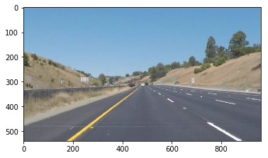
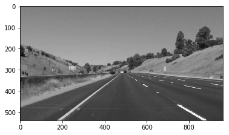
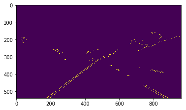
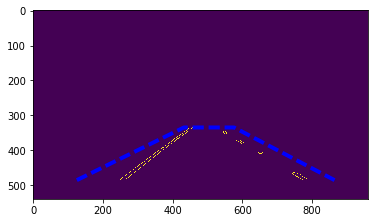
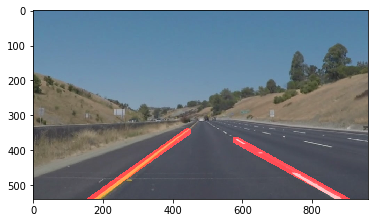

# lanelines
**Udacity - Self Driving Car - Term 1 - Finding Lane Lines on the Road**

The goal of this project is to build a software pipeline for an automatic recognition of road surface markings.

## Contents of the repo, license and code reuse
This repository contains an *ipython notebook* only, feel free to reuse it under terms of MIT license. In order to make it work, please refer to Environment set-up section below.

## Environment set-up

1. Before try this script, please install an environment with all required dependencies: https://github.com/udacity/CarND-Term1-Starter-Kit
2. Dowload also an input data from project's repository: https://github.com/udacity/CarND-LaneLines-P1
3. Copy the *lanelines.ipynb* to *CarND-LaneLines-P1* folder
4. Create a *test_videos_output* folder at *CarND-LaneLines-P1* for storage of output files after video processing.

## Reflection

This project is a nice programming exercise with arguably small practical outcome. In my opinion, a pure image processing has very limited applicability in a context of self-driving car guidance system. A possible alternative are some sort of machine learining algorithms that are capable to recognaize road markings, road limits and obstacles in a more robust way than Canny/Hough transforms.

### 1. Software pipeline

The pipeline is composed by the following steps, derived from the first module of Self Driving Car course:

**Step 1** Load an image.

**Step 2** Transform it to grayscale.

**Step 3** Apply Gaussian blur filter. Picture below is an example of Gaussian blur application, where a kernel size equals 11.

**Step 4** Apply the Canny transform

**Step 5** Delimit an area of interest

**Step 6** The objective is to draw lines over two road markings (left and right). So, process an image in a following way:
  - Apply the Hough transform and receive an array with line coordinates;
  - Find line coordinates relative to the left and to the right road marking;
  - Extend line extremities to cover the area of interest, especially in case of segmented markings and bottom boundary of the image.

### 2. *draw_lines()* function update
The *draw_lines()* filters an array resulting from the Hough transform and tries to find limits for road marking lines from the left and the right. The next step is to extend them to cover a region of interest by application of the general form of a sraight line equation.

### 3. Potential shortcomings of the pipeline

* The pipeline is built considering the fact that there is marking on a road surface. There is no step for detection with true/false outcome.

* Another shortcoming could be a change of camera/car position. Current algorithm is based on the fact that the car is close to the center of the lane and a camera  is in the middle of the car's windshield. There is a certain tolerance, but significant changes of these parameters may lead to wrong road marking detection.

### 4. Possible improvements to the pipeline

* Since this algorithm is made mostly for human eyes, in order to avoid jumps between frames, a possible improvement would be to smooth overlayed guides' position in time.

* Overlayed guides are based on one point and not on a mean of points of road marking. It might be interesting to use a mean value to avoid misleading overlay.

* Define road markings better than by delimiting trapezoid.

* Write a better code.
